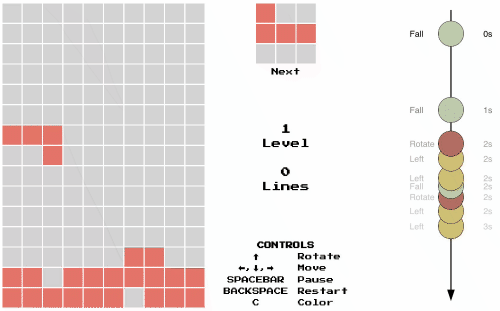

<h1 align="center">
   
  
   
  reactris = tetris + reactive
   
</h1>

<h4 align="center">A tetris clone build with <a href="http://reactjs.org" target="_blank">React</a> and <a href="http://reactivex.io/" target="_blank">RxJS</a>.</h4>

  <a href="#key-features">Key Features</a> •
  <a href="#implementation-ideas">Implementation Ideas</a> •
  <a href="#credits">Credits</a> •
  <a href="#license">License</a>

This is a prototype implementation of the Tetris game with the reactive programming paradigm in mind.
Check out the running prototype [here](https://rschw.xyz/reactris) on my website.
The controls are keyboard based so the game will not work on mobile devices.

## Key Features
- frontend based on [React](http://reactjs.org)
- reactive game loop implementation based on [RxJS](http://reactivex.io/)
- event stream visualization is done through a SVG marble diagram

## Implementation Ideas
- think of everything as a stream which propagates change
- streams originate from a producer (observable), where data flows through a pipeline, arriving at a consumer (observer)
    - in tetris the events are produced asynchronously by keyboard inputs and a game interval ticker for the falling tetrimino
    - the pipeline implements the game that handles the event stream and updates the game state
    - the consumer in this case is a React component displaying game state as a CSS grid
- stick to an immutable program by never changing or modifying data after it's been created or its variables have been declared (functional programming)
- keep the program side effect-free by not depending on data outside the stream (side effects should be implemented by observer)
- make streams testable
- visualize event stream with respect to time as marble diagram

## Credits
This software uses the following open source packages:

- [React](http://reactjs.org)
- [RxJS](http://reactivex.io/)

## License
MIT
